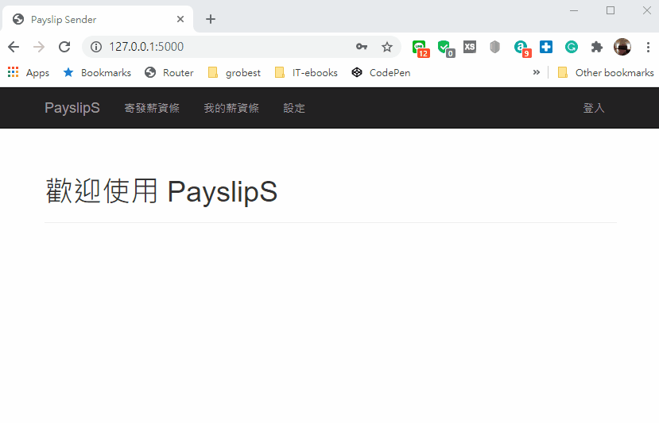

# PayslipS

&nbsp;&nbsp;&nbsp;&nbsp;&nbsp;&nbsp;&nbsp;&nbsp;PayslipS 是使用 Python 開發的應用程式, 可藉由選取支薪期間、部門，及員工編號取得 ERP 中的薪資資料, 並寄發薪資條

## Install
* [Microsoft® ODBC Driver 13 for SQL Server®Windows + Linux](https://www.microsoft.com/en-us/download/details.aspx?id=50420)
* [WeasyPrint](https://weasyprint.readthedocs.io/en/stable/install.html#msys2-gtk)

## Overview
 

## Log

log/payslip_sender.log

