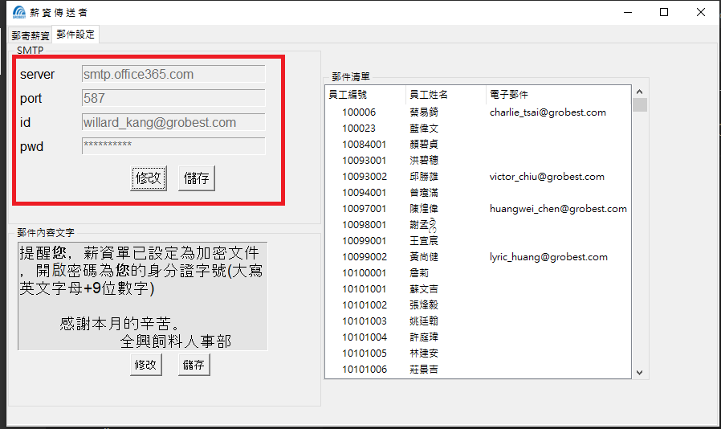
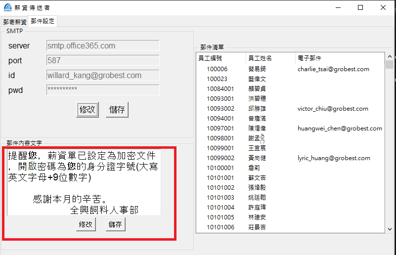
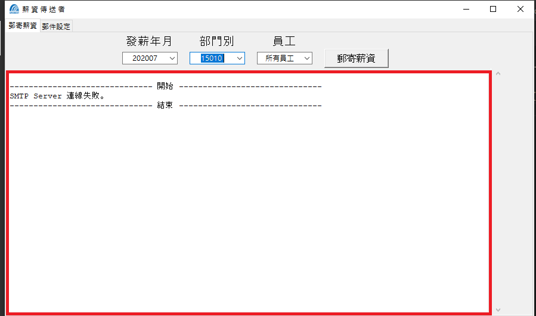
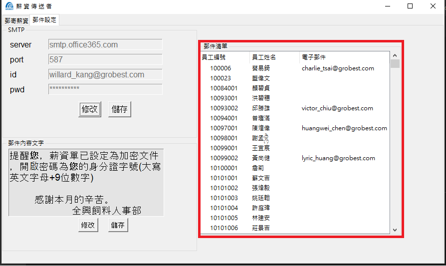
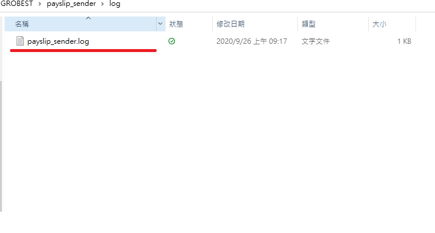

# Payslip sender 薪資傳送者

&nbsp;&nbsp;&nbsp;&nbsp;&nbsp;&nbsp;&nbsp;&nbsp;Payslip sender 是一個以 MVC 架構開發的 python 應用程式, 可藉由選取支薪期間、部門，及員工編號取得 workflowERP 中的薪資資料, 並寄發薪資條

### 軟體安裝
* [Microsoft® ODBC Driver 13 for SQL Server®Windows + Linux](https://www.microsoft.com/en-us/download/details.aspx?id=50420)
* [WeasyPrint](https://weasyprint.readthedocs.io/en/stable/install.html#msys2-gtk)

### 設定連線資訊

config.ini

```
[database]
server = server
database = yourDB
username = userName
pwd = yourPWD

[smtp]
server = smtpServer
port = port
id = yourID
password = yourPWD

```

### 應用程式操作流程
步驟 1. 設定 SMTP Server (寄件者) 

步驟 2. 編輯郵件內容 

步驟 3. 選取收件者並寄發郵件 

步驟 4. 確認郵件是否發送成功 

步驟 5. 確認郵件地址是否正確 


### 檢視記錄檔

log/payslip_sender.log


