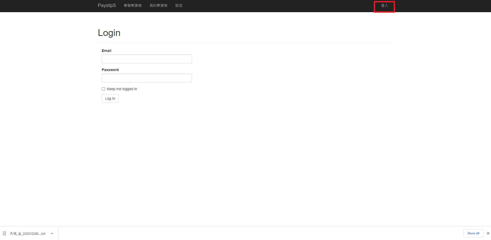
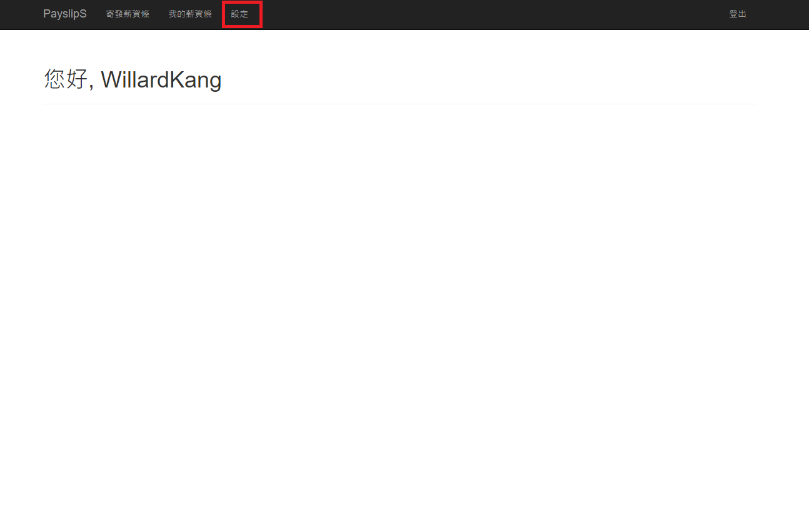
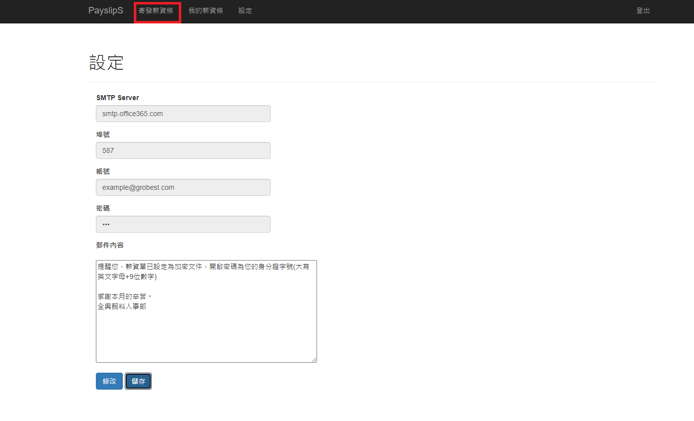
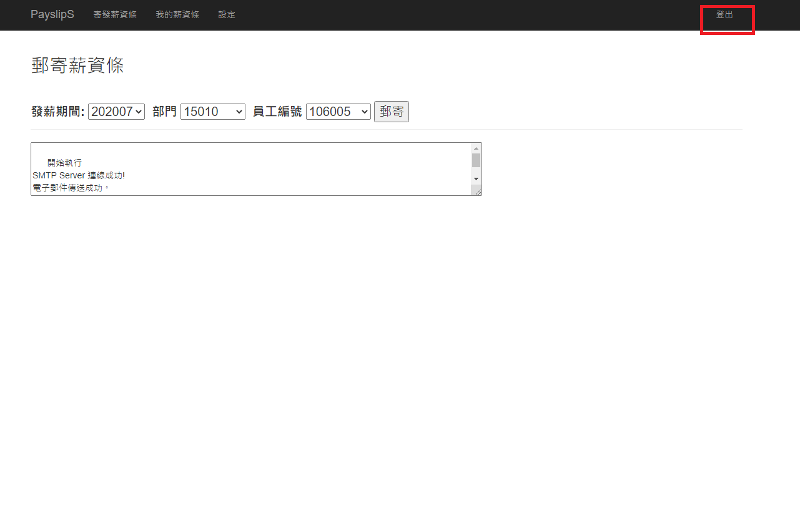

# Payslip sender 薪資傳送者

&nbsp;&nbsp;&nbsp;&nbsp;&nbsp;&nbsp;&nbsp;&nbsp;PayslipS 是使用 Flask 開發的應用程式, 可藉由選取支薪期間、部門，及員工編號取得 workflowERP 中的薪資資料, 並寄發薪資條

### 軟體安裝
* [Microsoft® ODBC Driver 13 for SQL Server®Windows + Linux](https://www.microsoft.com/en-us/download/details.aspx?id=50420)
* [WeasyPrint](https://weasyprint.readthedocs.io/en/stable/install.html#msys2-gtk)

### 應用程式操作流程
步驟 1. 使用電子郵件登入系統 

步驟 2. 選取設定頁面 

步驟 3. 輸入電子郵件資料 

步驟 4. 儲存資料並點擊跳至郵寄頁面 

步驟 5. 選取郵寄對象並寄發薪資條 

步驟 6. 使用完記得登出 

### 檢視記錄檔

log/payslip_sender.log

### FAQ
