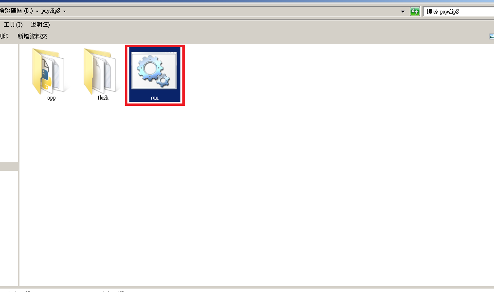
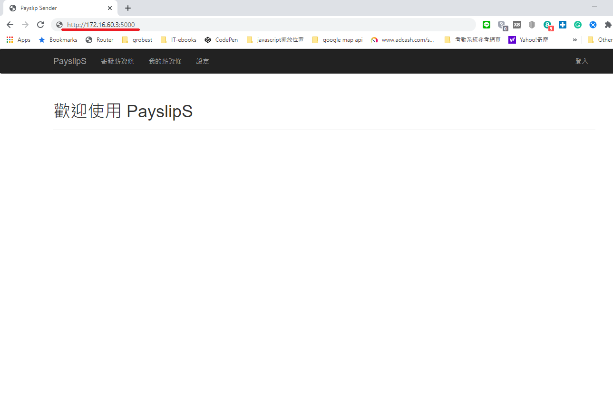
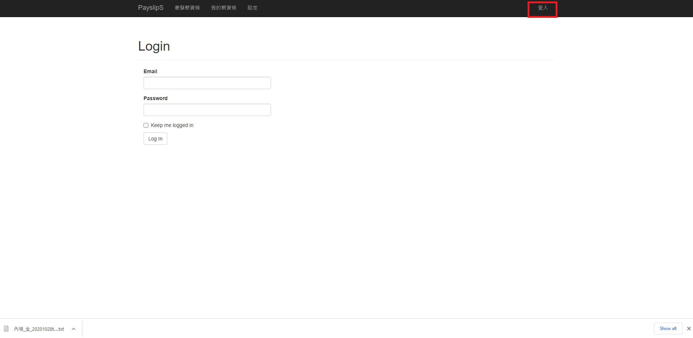
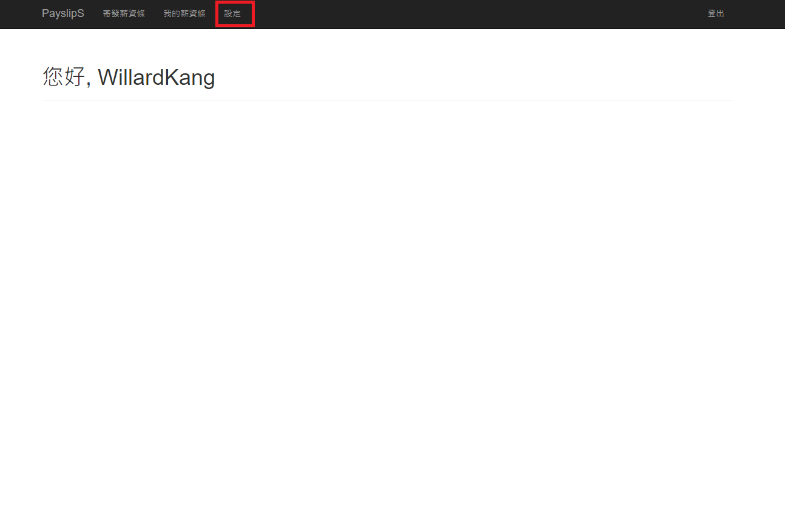
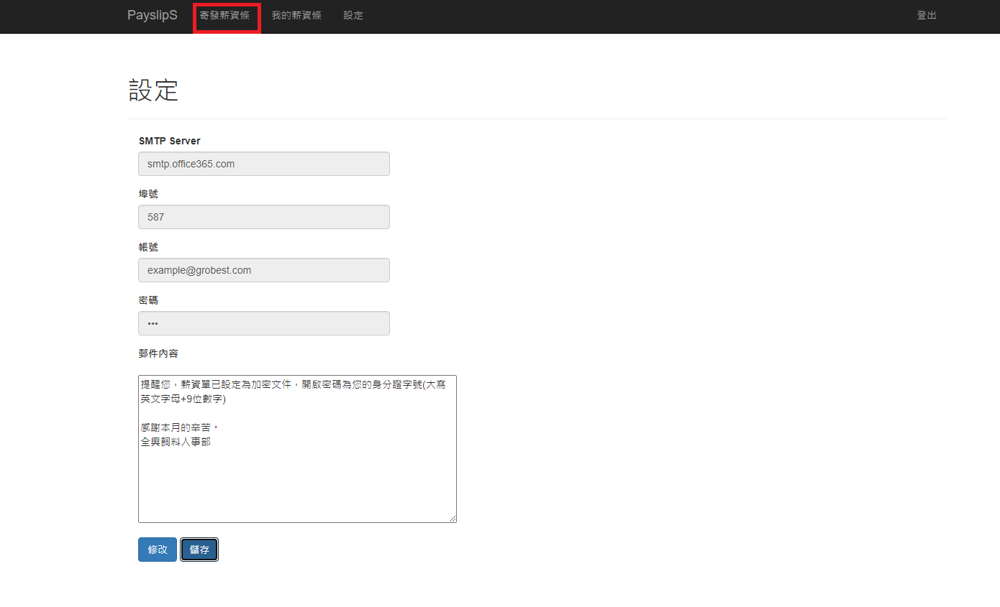
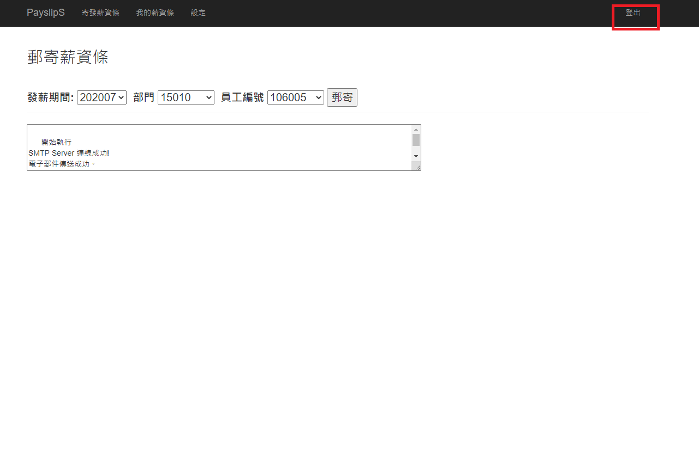

# PayslipS 薪資傳送者

&nbsp;&nbsp;&nbsp;&nbsp;&nbsp;&nbsp;&nbsp;&nbsp;PayslipS 是使用 Python 開發的應用程式, 可藉由選取支薪期間、部門，及員工編號取得 ERP 中的薪資資料, 並寄發薪資條

### 軟體安裝
* [Microsoft® ODBC Driver 13 for SQL Server®Windows + Linux](https://www.microsoft.com/en-us/download/details.aspx?id=50420)
* [WeasyPrint](https://weasyprint.readthedocs.io/en/stable/install.html#msys2-gtk)

### 啟動程式
點擊批次檔執行程式
 

### 應用程式操作流程

步驟 1. 連線系統網頁
 

步驟 2. 使用電子郵件登入系統
 

步驟 3. 選取設定頁面
 

步驟 4. 輸入電子郵件資料
 

步驟 5. 儲存資料並點擊跳至郵寄頁面
 

步驟 6. 選取郵寄對象並寄發薪資條
 

步驟 7. 使用完記得登出
 

### 檢視記錄檔

log/payslip_sender.log

### FAQ
